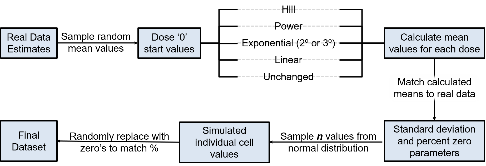

## Setting up the environment and displaying session information for reproducibility
```{r}
library(doParallel, quietly = TRUE)
library(dplyr, quietly = TRUE)
library(ggplot2, quietly = TRUE)
library(Seurat, quietly = TRUE)
library(DiagrammeR, quietly = TRUE)
source_path = 'C:\\Users\\15177\\OneDrive - Michigan State University\\Documents\\Projects\\Prj161-snSeq-Mm_TCDD_DR_Sept2019\\snSeq-DGE\\R\\simulation_functions.R'
source('../R/dose_response_models.R')
source(source_path)
sessionInfo()
memory.limit(size = 64000)
```

## __Deriving parameters from real data__
### Import a Seurat object
The following Seurat object was subset from a dose-response experiment using mice described here _(TODO: add link)_
Cell type cluster 1 is used as an example. 
```{r}
RealParamsFull = readRDS('EstimatedParameters.RData')
realData = RealParamsFull %>% filter(category == 'pass') %>% filter(Cells == 7)
rm(RealParamsFull)
```

#### Visualization of estimated parameters
```{r fig.width = 20, fig.height = 8}
P1 = ggplot(data = realData %>% filter(category == 'pass') , aes(x = mean, y = percent_zero, colour = factor(meta_var))) +
  geom_point() +
  ggtitle('') +
  theme_classic()

P2 = ggplot(data = realData %>% filter(category == 'pass') , aes(x = mean_real, y = percent_zero, colour = factor(meta_var))) +
  geom_point() +
  ggtitle('') +
  theme_classic()

P3 = ggplot(data = realData %>% filter(category == 'pass') , aes(x = mean, y = mean_real, colour = factor(meta_var))) +
  geom_point() +
  ggtitle('Correlation of estimated mean and mean expression') +
  theme_classic()

P4 = ggplot(data = realData %>% filter(category == 'pass') , aes(x = percent_zero, y = var_real, colour = factor(meta_var))) +
  geom_point() +
  ggtitle('') +
  theme_classic()

P5 = ggplot(data = realData %>% filter(category == 'pass') , aes(x = mean_real, y = var_real, colour = factor(meta_var))) +
  geom_point() +
  ggtitle('') +
  theme_classic()

P6 = ggplot(data = realData %>% filter(category == 'pass') , aes(x = mean, y = sd, colour = factor(meta_var))) +
  geom_point() +
  ggtitle('') +
  theme_classic()

figure = ggpubr::ggarrange(P1, P2, P3, P4, P5, P6, labels = c("A", "B", "C", "D", "E", "F"), ncol = 3, nrow = 2)
figure
```
Overview of real parameter estimates by dose for single-nuclei cluster 3. As is evident in these plots, treatment affects mean estimates, the relationship between zero's and the mean, and the variance.


## SIMULATE

### Simulation parameters
```{r}
sim.doses = c(0, 0.01, 0.03, 0.1, 0.3, 1, 3, 10, 30) 
num.doses = length(sim.doses)
ncells = 500
min.mean = min(realData$mean); print(paste('minimum mean expression: ', min.mean, sep =''))
max.mean = max(realData$mean); print(paste('maximum mean expression: ', max.mean, sep =''))
s = 0 #Start ID for simulated data
```

#### Hill
response = gamma + ( V * dose^n )/( k^n + dose^n )
```{r}
set.seed(1654)
hill.up = runSimulation(n = 150, start_id = s, class = 'Hill', realData = realData)
ggplot(data = reshape2::melt(hill.up$parameters), aes(x = value)) +
  facet_wrap(~variable, scales = 'free') +
  geom_density() +
  theme_bw()

hill.down = runSimulation(n = 150, start_id = hill.up$stop_id, class = 'Hill', realData = realData, downregulated = TRUE)
ggplot(data = reshape2::melt(hill.down$parameters), aes(x = value)) +
  facet_wrap(~variable, scales = 'free') +
  geom_density() +
  theme_bw()
```


#### Exponential
  response = a * exp( sign * (b * dose)^1 )
```{r}
set.seed(2353)
exp.up = runSimulation(n = 150, start_id = hill.down$stop_id, class = 'Exp', realData = realData, downregulated = FALSE)
ggplot(data = reshape2::melt(exp.up$parameters), aes(x = value)) +
  facet_wrap(~variable, scales = 'free') +
  geom_density() +
  theme_bw()

exp.down = runSimulation(n = 150, start_id = exp.up$stop_id, class = 'Exp', realData = realData, downregulated = TRUE)
ggplot(data = reshape2::melt(exp.down$parameters), aes(x = value)) +
  facet_wrap(~variable, scales = 'free') +
  geom_density() +
  theme_bw()

```


#### Exponential2
  response = a * exp( sign * (b * dose)^d )
```{r}
set.seed(8654)
exp2.up = runSimulation(n = 150, start_id = exp.down$stop_id, class = 'Exp', realData = realData, downregulated = FALSE, power = TRUE)
ggplot(data = reshape2::melt(exp2.up$parameters), aes(x = value)) +
  facet_wrap(~variable, scales = 'free') +
  geom_density() +
  theme_bw()

exp2.down = runSimulation(n = 150, start_id = exp2.up$stop_id, class = 'Exp', realData = realData, downregulated = TRUE, power = TRUE)
ggplot(data = reshape2::melt(exp2.down$parameters), aes(x = value)) +
  facet_wrap(~variable, scales = 'free') +
  geom_density() +
  theme_bw()
```

#### Exponential3
  response = a * (c - (c - 1) * exp( -1 * (b * doses)^d ))
```{r}
set.seed(1532)
exp3.up = runSimulation(n = 150, start_id = exp2.down$stop_id, class = 'ExpB', realData = realData, downregulated = FALSE)
ggplot(data = reshape2::melt(exp3.up$parameters), aes(x = value)) +
  facet_wrap(~variable, scales = 'free') +
  geom_density() +
  theme_bw()

exp3.down = runSimulation(n = 150, start_id = exp3.up$stop_id, class = 'ExpB', realData = realData, downregulated = TRUE)
ggplot(data = reshape2::melt(exp3.down$parameters), aes(x = value)) +
  facet_wrap(~variable, scales = 'free') +
  geom_density() +
  theme_bw()
```


#### Power
  response = gamma + beta * doses^delta
```{r}
set.seed(3322)
pow.up = runSimulation(n = 150, start_id = exp3.down$stop_id, class = 'Power', realData = realData, downregulated = FALSE, power = TRUE)
ggplot(data = reshape2::melt(pow.up$parameters), aes(x = value)) +
  facet_wrap(~variable, scales = 'free') +
  geom_density() +
  theme_bw()

pow.down = runSimulation(n = 150, start_id = pow.up$stop_id, class = 'Power', realData = realData, downregulated = TRUE, power = TRUE)
ggplot(data = reshape2::melt(pow.down$parameters), aes(x = value)) +
  facet_wrap(~variable, scales = 'free') +
  geom_density() +
  theme_bw()
```

#### Linear
  response = gamma + beta * doses
```{r}
set.seed(2213)
lin.up = runSimulation(n = 150, start_id = pow.down$stop_id, class = 'Linear', realData = realData, downregulated = FALSE, power = TRUE)
ggplot(data = reshape2::melt(lin.up$parameters), aes(x = value)) +
  facet_wrap(~variable, scales = 'free') +
  geom_density() +
  theme_bw()

lin.down = runSimulation(n = 150, start_id = lin.up$stop_id, class = 'Linear', realData = realData, downregulated = TRUE, power = TRUE)
ggplot(data = reshape2::melt(lin.down$parameters), aes(x = value)) +
  facet_wrap(~variable, scales = 'free') +
  geom_density() +
  theme_bw()
```

#### Unchanged
```{r}
set.seed(8653)
unchanged = runSimulation(n = 500, start_id = lin.down$stop_id, class = 'Unchanged', realData = realData)
```


Compile the data into single-cell format
```{r}
all.models = rbind(hill.up$data, hill.down$data, exp.up$data, exp.down$data, exp2.up$data, exp2.down$data, exp3.up$data, exp3.down$data, pow.up$data, pow.down$data,lin.up$data,
lin.down$data, unchanged$data)

simData1 = convert2snseq(realData, all.models, ncells, sd.scale = 1, p.zero = 2)
```

```{r}
n = 150
simGeneMeta = data.frame(
  Model = c(
    rep('hill', n*2),
    rep('exp', n*2),
    rep('exp2', n*2),
    rep('exp3', n*2),
    rep('power', n*2),
    rep('linear', n*2),
    rep('unchanged', 500)
  ),
  Direction = c(
    rep('Upregulated', n),
    rep('Downregulated', n),
    rep('Upregulated', n),
    rep('Downregulated', n),
    rep('Upregulated', n),
    rep('Downregulated', n),
    rep('Upregulated', n),
    rep('Downregulated', n),
    rep('Upregulated', n),
    rep('Downregulated', n),
    rep('Upregulated', n),
    rep('Downregulated', n),
    rep('NA', 500)
  )
)

out.sim1 = reformatForExport(simData1, simGeneMeta)
```


```{r}
import2 = out.sim1
import2$norm = as.matrix(import2$norm)
realData2 = rbind(
  realParams(import2, 4, metacol = 'Dose', metacriteria = 0, funpath = source_path),
  realParams(import2, 4, metacol = 'Dose', metacriteria = 0.01, funpath = source_path),
  realParams(import2, 4, metacol = 'Dose', metacriteria = 0.03, funpath = source_path),
  realParams(import2, 4, metacol = 'Dose', metacriteria = 0.1, funpath = source_path),
  realParams(import2, 4, metacol = 'Dose', metacriteria = 0.3, funpath = source_path),
  realParams(import2, 4, metacol = 'Dose', metacriteria = 1, funpath = source_path),
  realParams(import2, 4, metacol = 'Dose', metacriteria = 3, funpath = source_path),
  realParams(import2, 4, metacol = 'Dose', metacriteria = 10, funpath = source_path),
  realParams(import2, 4, metacol = 'Dose', metacriteria = 30, funpath = source_path)
)
realData2 = realData2 %>% filter(category == 'pass')
```

```{r fig.width = 20, fig.height = 8}
P1 = ggplot(data = realData2 %>% filter(category == 'pass') , aes(x = mean, y = percent_zero, colour = factor(meta_var))) +
  geom_point() +
  ggtitle('Correlation of estimated mean (non-zero) and percent zeros') +
  theme_classic()

P2 = ggplot(data = realData2 %>% filter(category == 'pass') , aes(x = mean, y = mean_nonzero, colour = factor(meta_var))) +
  geom_point() +
  ggtitle('Correlation of estimated mean and mean expression (non-zero)') +
  theme_classic()

P3 = ggplot(data = realData2 %>% filter(category == 'pass') , aes(x = mean, y = mean_real, colour = factor(meta_var))) +
  geom_point() +
  ggtitle('Correlation of estimated mean and mean expression') +
  theme_classic()

P4 = ggplot(data = realData2 %>% filter(category == 'pass') , aes(x = mean_nonzero, y = percent_zero, colour = factor(meta_var))) +
  geom_point() +
  ggtitle('Correlation of estimated mean and mean expression (non-zero)') +
  theme_classic()

P5 = ggplot(data = realData2 %>% filter(category == 'pass') , aes(x = mean_real, y = percent_zero, colour = factor(meta_var))) +
  geom_point() +
  ggtitle('') +
  theme_classic()

P6 = ggplot(data = realData2 %>% filter(category == 'pass') , aes(x = percent_zero, y = var_real, colour = factor(meta_var))) +
  geom_point() +
  ggtitle('') +
  theme_classic()

P7 = ggplot(data = realData2 %>% filter(category == 'pass') , aes(x = mean_real, y = var_real, colour = factor(meta_var))) +
  geom_point() +
  ggtitle('') +
  theme_classic()

P8 = ggplot(data = realData2 %>% filter(category == 'pass') , aes(x = mean, y = sd, colour = factor(meta_var))) +
  geom_point() +
  ggtitle('') +
  theme_classic()

figure = ggpubr::ggarrange(P1, P2, P3, P4, P5, P6, P7, P8, labels = c("A", "B", "C", "D", "E", "F", "G", "H"), ncol = 4, nrow = 2)
figure
```

Compile the data into single-cell format by dose
```{r}
simData1B = convert2snseq(realData %>% filter(meta_var == 0), all.models %>% filter(doses == 0), ncells)
simData1C = convert2snseq(realData %>% filter(meta_var == 30), all.models %>% filter(doses == 0.01), ncells)
simData1D = convert2snseq(realData %>% filter(meta_var == 30), all.models %>% filter(doses == 0.03), ncells)
simData1E = convert2snseq(realData %>% filter(meta_var == 30), all.models %>% filter(doses == 0.1), ncells)
simData1F = convert2snseq(realData %>% filter(meta_var == 30), all.models %>% filter(doses == 0.3), ncells)
simData1G = convert2snseq(realData %>% filter(meta_var == 30), all.models %>% filter(doses == 1), ncells)
simData1H = convert2snseq(realData %>% filter(meta_var == 30), all.models %>% filter(doses == 3), ncells)
simData1I = convert2snseq(realData %>% filter(meta_var == 30), all.models %>% filter(doses == 10), ncells)
simData1J = convert2snseq(realData %>% filter(meta_var == 30), all.models %>% filter(doses == 30), ncells)
simData1B$difftab = rbind(simData1B$difftab, simData1C$difftab, simData1D$difftab, simData1E$difftab, simData1F$difftab, simData1G$difftab, simData1H$difftab, simData1I$difftab, simData1J$difftab) 
simData1B$out2 = rbind(simData1B$out2, simData1C$out2, simData1D$out2, simData1E$out2, simData1F$out2, simData1G$out2, simData1H$out2, simData1I$out2, simData1J$out2) 
```

```{r}
n = 150
simGeneMeta = data.frame(
  Model = c(
    rep('hill', n*2),
    rep('exp', n*2),
    rep('exp2', n*2),
    rep('exp3', n*2),
    rep('power', n*2),
    rep('linear', n*2),
    rep('unchanged', 500)
  ),
  Direction = c(
    rep('Upregulated', n),
    rep('Downregulated', n),
    rep('Upregulated', n),
    rep('Downregulated', n),
    rep('Upregulated', n),
    rep('Downregulated', n),
    rep('Upregulated', n),
    rep('Downregulated', n),
    rep('Upregulated', n),
    rep('Downregulated', n),
    rep('Upregulated', n),
    rep('Downregulated', n),
    rep('NA', 500)
  )
)

out.sim1B = reformatForExport(simData1B, simGeneMeta)
```

```{r}
import3 = out.sim1B
import3$norm = as.matrix(import3$norm)
realData3 = rbind(
  realParams(import3, 4, metacol = 'Dose', metacriteria = 0, funpath = source_path),
  realParams(import3, 4, metacol = 'Dose', metacriteria = 0.01, funpath = source_path),
  realParams(import3, 4, metacol = 'Dose', metacriteria = 0.03, funpath = source_path),
  realParams(import3, 4, metacol = 'Dose', metacriteria = 0.1, funpath = source_path),
  realParams(import3, 4, metacol = 'Dose', metacriteria = 0.3, funpath = source_path),
  realParams(import3, 4, metacol = 'Dose', metacriteria = 1, funpath = source_path),
  realParams(import3, 4, metacol = 'Dose', metacriteria = 3, funpath = source_path),
  realParams(import3, 4, metacol = 'Dose', metacriteria = 10, funpath = source_path),
  realParams(import3, 4, metacol = 'Dose', metacriteria = 30, funpath = source_path)
)
realData3 = realData3 %>% filter(category == 'pass')
```

```{r fig.width = 20, fig.height = 8}
P1 = ggplot(data = realData3 %>% filter(category == 'pass') , aes(x = mean, y = percent_zero, colour = factor(meta_var))) +
  geom_point() +
  ggtitle('Correlation of estimated mean (non-zero) and percent zeros') +
  theme_classic()

P2 = ggplot(data = realData3 %>% filter(category == 'pass') , aes(x = mean, y = mean_nonzero, colour = factor(meta_var))) +
  geom_point() +
  ggtitle('Correlation of estimated mean and mean expression (non-zero)') +
  theme_classic()

P3 = ggplot(data = realData3 %>% filter(category == 'pass') , aes(x = mean, y = mean_real, colour = factor(meta_var))) +
  geom_point() +
  ggtitle('Correlation of estimated mean and mean expression') +
  theme_classic()

P4 = ggplot(data = realData3 %>% filter(category == 'pass') , aes(x = mean_nonzero, y = percent_zero, colour = factor(meta_var))) +
  geom_point() +
  ggtitle('Correlation of estimated mean and mean expression (non-zero)') +
  theme_classic()

P5 = ggplot(data = realData3 %>% filter(category == 'pass') , aes(x = mean_real, y = percent_zero, colour = factor(meta_var))) +
  geom_point() +
  ggtitle('') +
  theme_classic()

P6 = ggplot(data = realData3 %>% filter(category == 'pass') , aes(x = percent_zero, y = var_real, colour = factor(meta_var))) +
  geom_point() +
  ggtitle('') +
  theme_classic()

P7 = ggplot(data = realData3 %>% filter(category == 'pass') , aes(x = mean_real, y = var_real, colour = factor(meta_var))) +
  geom_point() +
  ggtitle('') +
  theme_classic()

P8 = ggplot(data = realData3 %>% filter(category == 'pass') , aes(x = mean, y = sd, colour = factor(meta_var))) +
  geom_point() +
  ggtitle('') +
  theme_classic()

figure = ggpubr::ggarrange(P1, P2, P3, P4, P5, P6, P7, P8, labels = c("A", "B", "C", "D", "E", "F", "G", "H"), ncol = 4, nrow = 2)
figure
```